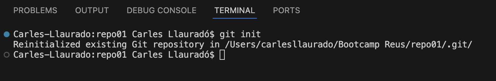
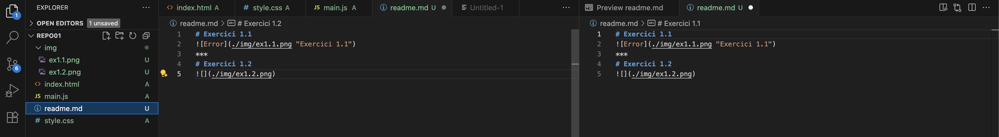
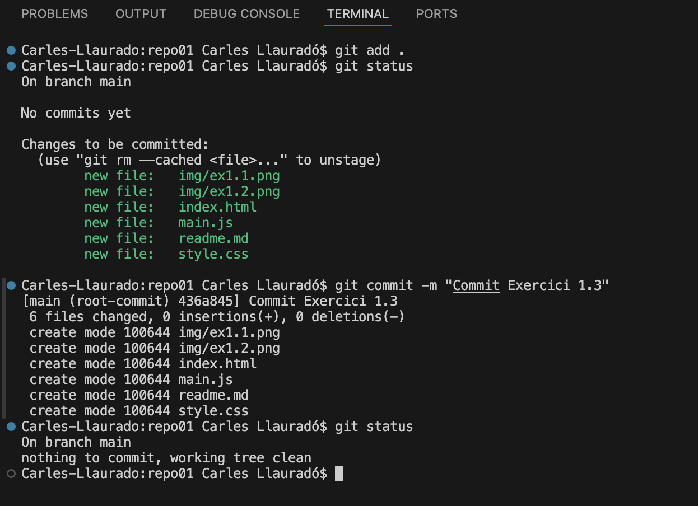
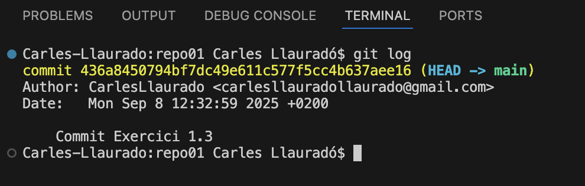
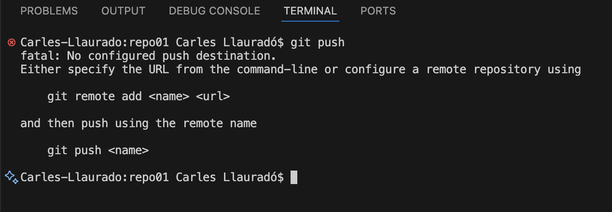
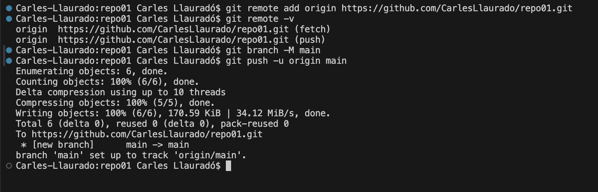
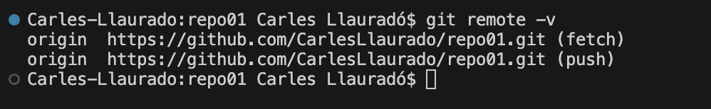
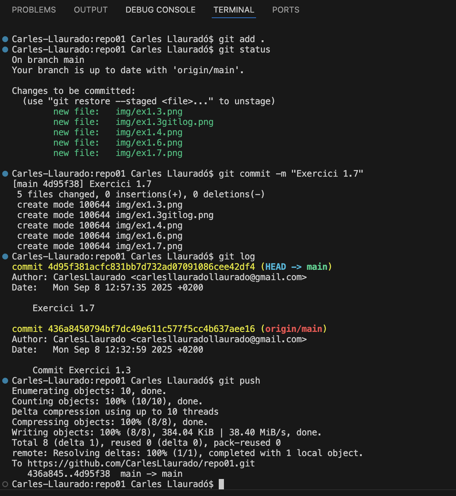

# Exercici 1
## Exercici 1.1

***

## Exercici 1.2

***

## Exercici 1.3

***

## Exercici 1.4

El fichero está confirmado en el repositorio local, pero aún no está vinculado a ningún repositorio en la nube.
***

## Exercici 1.5
git remote -v ---> no aparece nada, porque aun no hay ningún respositorio remoto configurado
***

## Exercici 1.6

***

## Exercici 1.7

Ahora si esta vinculado con el repositorio de github
***

## Exercici 1.8

***
